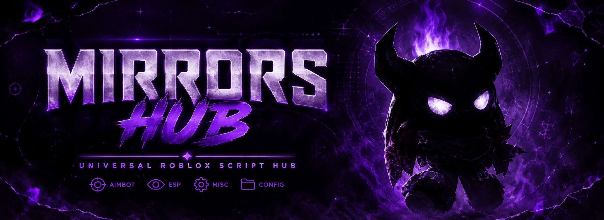
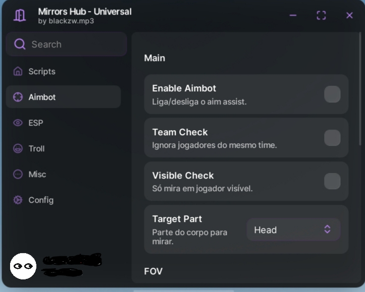

<div align="center">



# 🎭 Mirrors Hub

Minimal dark purple Roblox script hub focused on clean visuals, performance and customization.

<br>


</div>

---

# 📸 Preview

<p align="center">
  
</p>

---

# ✨ Features

### 🎯 Aimbot
- Smooth aiming
- FOV system
- Target selection
- Team check
- Visibility check
- Adjustable smoothness
- Adjustable strength

### 👁️ ESP
- Highlight ESP
- Name ESP
- Health ESP
- Distance ESP
- Screen tracers
- Team check
- Fill customization
- Text customization

### ⚙️ Misc
- WalkSpeed
- JumpPower
- Noclip
- Infinite Jump
- Anti AFK
- Rejoin
- Server Hop
- Small Server Finder

### 🛠️ Config System
- Auto load
- Auto save
- Native WindUI config manager
- Toggle keybind support

---

# 🚀 Loadstring

```lua
loadstring(game:HttpGet("https://raw.githubusercontent.com/blackzww/robloxscripts/main/Mirrors%20Hub%20-%20Universal/universal.lua"))()
